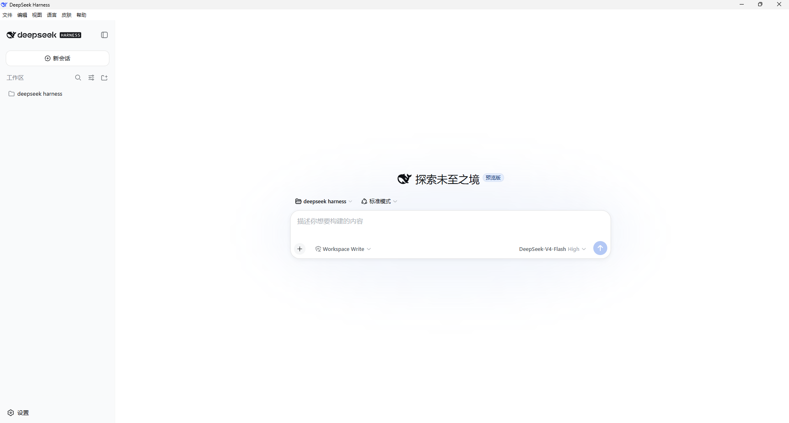
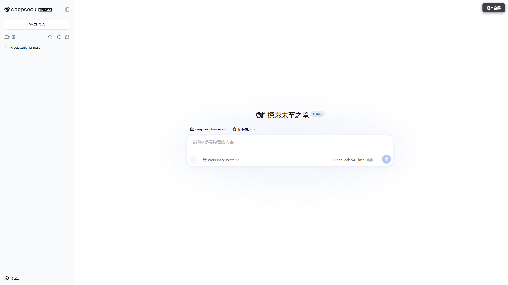
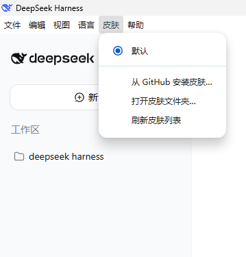
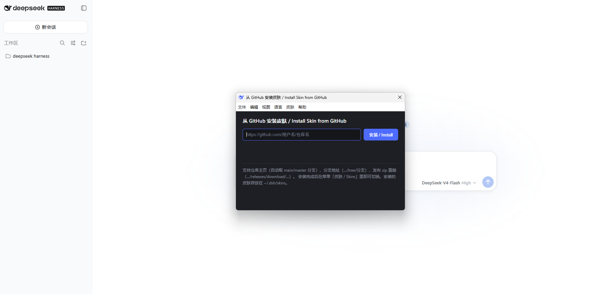

<div align="center">

# 🖥️ DeepSeek Harness Desktop

**把 DeepSeek Harness AI 助手装进原生 Windows 桌面应用**
*Turn the DeepSeek Harness AI agent into a native Windows desktop app*

[](package.json)
[](LICENSE)
[](https://github.com/LTX888888/deepseek-harness-desktop/releases)
[](https://www.electronjs.org/)
[](https://nodejs.org/)

</div>

---

## ✨ 为什么用桌面版？ / Why a desktop app?

| 🪟 原生窗口 | 告别浏览器标签页，独立窗口 + 专属图标 + 任务栏常驻 |
|---|---|
| 🚀 开箱即用 | **完全自包含**——内置 AI 引擎和 Node 运行时，装完即用，零依赖 |
| 🌐 中英一键切换 | 菜单栏「语言」实时切换 中文/English，无需重启 |
| 🎨 皮肤管理 | 菜单栏「皮肤」一键切换主题，皮肤丢进 `~/.dsh/skins` 即可反复切换 |
| ⚡ 增量更新 | 改功能**只传几 KB 的补丁 zip**，不再搬 123 MB 完整安装包 |
| 🎯 可选安装目录 | 向导式安装器，**安装时可自定义安装路径**（按用户安装，无需管理员权限） |
| 🔄 一键覆盖更新 | 新版安装包双击即覆盖，无需卸载旧版 |
| 🗑️ 独立卸载程序 | 开始菜单里即可点「卸载 DeepSeek Harness」，也能从「程序和功能」干净卸载（自定义目录同样干净清除） |
| 🔒 数据安全 | 所有会话、设置、凭据留在本机 `$DSH_HOME`，绝不打包上传 |

## 📸 截图 / Screenshot

| 标准界面 / Main UI | 全屏 / Fullscreen |
| --- | --- |
|  |  |

| 皮肤菜单 / Skins menu | 从 GitHub 安装皮肤 / Install from GitHub |
| --- | --- |
|  |  |

## 🚀 快速开始 / Quick Start

**方式一：安装版（推荐）** —— 双击 `DeepSeek-Harness-Setup-*.exe`，向导式安装，**可自定义安装目录**，自动建桌面/开始菜单快捷方式。

**方式二：便携版** —— 下载 `DeepSeek-Harness-Portable-*.exe`，双击即用，无需安装。

> 首次启动自动内置引擎，之后每次打开就是你的 AI 工作台。

## 🎨 皮肤 / Skins

菜单栏「皮肤」里可以**实时切换主题**，无需重启、无需刷新页面。

- **一键安装**：菜单「皮肤 → 从 GitHub 安装皮肤…」，粘贴仓库地址（如 `https://github.com/用户名/仓库名`）自动下载安装，支持仓库主页 / 分支（`…/tree/分支`）/ 发布 zip 直链
- 皮肤目录：`~/.dsh/skins`（`$DSH_HOME/skins`）——菜单里点「打开皮肤文件夹」可直接进入
- 从 GitHub 下载的皮肤，解压后整个文件夹丢进去也可用

两种皮肤格式（任选其一）：

1. **单个 CSS 文件**：把 `my-theme.css` 直接放进 `skins/` 目录
2. **皮肤文件夹**：`skins/我的皮肤/skin.css`（必需）+ 可选 `skin.json`：
   ```json
   { "name": "我的皮肤", "author": "作者", "version": "1.0.0", "description": "说明" }
   ```

## 🧠 技术亮点 / Tech Highlights

- **自包含引擎**：内置 npm 发布的 `@deepseek-ai/dsh` 全量运行时（约 250MB 依赖），用 Electron 自带 Node 22.19 直接运行，无需系统 Node、无需检出仓库
- **端口智能复用**：检测到已有 harness 实例（3080）自动复用，避免多实例冲突
- **实时语言切换**：菜单写 `settings.yaml` → harness 热发布（chokidar watch）→ 前端即时切换
- **增量补丁机制**：`asarUnpack` 把代码解包成普通文件，`npm run make-patch` 对比基线生成几 KB 补丁，`apply-patch.cmd` 秒级覆盖更新
- **向导式安装器**：NSIS assisted，可选安装目录、按用户安装（免管理员）、同 appId 自动覆盖升级、保留用户数据

## 🔧 开发者 / For Developers

```bash
npm install              # 安装构建依赖
npm run prepare-runtime  # 拉取内置 harness 运行时（npm @deepseek-ai/dsh）
npm start                # 开发模式启动

npm run patch            # 增量更新本机已安装应用（直接覆盖 src 代码）
npm run make-patch       # 生成增量补丁 zip（对比上次基线，只含改动文件）
npm run dist             # 完整打包（自动 bump 版本 + 安装/便携/卸载三件套）
npm run release          # dist + make-patch 一步产出「安装包 + 补丁」
npm run dist:minor       # minor 版本打包
npm run dist:major       # major 版本打包
```

产物（`release/`）：
- `DeepSeek-Harness-Setup-<version>.exe` — 一键覆盖安装器（123 MB，仅新机器/首次安装需要）
- `DeepSeek-Harness-Portable-<version>.exe` — 免安装便携版
- `DeepSeek-Harness-Uninstall-<version>.exe` — 独立卸载程序

补丁（`patches/`）：
- `patch-<旧版本>-to-<新版本>.zip` — **只有几 KB**。已装用户解压后双击 `apply-patch.cmd`（或右键 `apply-patch.ps1` 用 PowerShell 运行），重启应用即更新到新版本，**不需要再搬 123 MB 安装包**。安装目录可自定义，补丁脚本会自动从注册表定位实际安装位置
- `src-manifest.json` — 补丁基线（每次 `make-patch` 自动滚动）
- ⚠️ **补丁只能覆盖已存在的文件**：应用从 `app.asar` 加载代码，asar 目录树在打包时固定，**新增/删除 `src/` 文件必须发完整安装包**（`npm run make-patch` / `npm run patch` 会自动检测新增文件并阻止/跳过）

## 🏗️ 架构 / Architecture

```
src/
├── main.cjs             # Electron 主进程（窗口、菜单、生命周期、日志）
├── harness.cjs          # harness 服务管理（定位、选端口、就绪等待、清理）
├── settings.cjs         # settings.yaml 读写（语言偏好、皮肤偏好）
├── skins.cjs            # 皮肤发现与读取（~/.dsh/skins）
├── skin-install.cjs     # 从 GitHub 一键安装皮肤（下载/解压/定位/安装）
├── skin-install.html    # 皮肤安装对话框页面
├── skin-install-preload.cjs # 皮肤安装对话框 IPC 桥
├── preload.cjs          # 安全渲染桥（contextIsolation）
scripts/
├── bump-version.cjs     # 版本自动递增（patch/minor/major）
├── post-dist.cjs        # 打包后自动清理 + 刷新卸载程序
├── patch.cjs            # 增量更新：直接覆盖本机已安装应用的代码
├── make-patch.cjs       # 发布工具：对比基线生成增量补丁 zip
├── apply-patch.template.ps1 # 补丁应用脚本模板（打进补丁 zip）
├── prepare-runtime.cjs  # 拉取内置 harness 运行时
└── gen-icon.cjs         # 从 favicon 渲染应用图标
build/
└── installer.nsh        # NSIS 定制：开始菜单里的「卸载」快捷方式
```

## 🔒 数据安全 / Privacy

应用**只读取、从不打包**你的数据：
- 会话、设置、API 凭据都存放在 `$DSH_HOME`（默认 `~/.dsh`）——完全本机、项目之外
- 打包产物和代码中**不含任何用户数据或密钥**
- 代码中零硬编码路径，可放心审计

## 📄 License

[MIT](LICENSE)

---

<div align="center">
⭐ 如果这个项目对你有帮助，欢迎 Star！ · 用 ❤️ 和 DeepSeek Harness 构建
</div>
